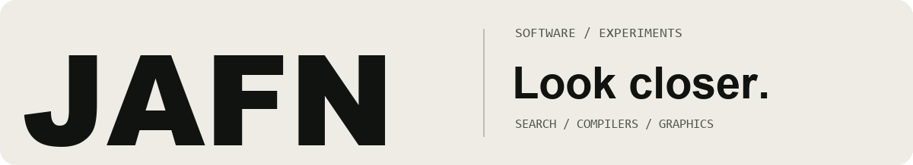
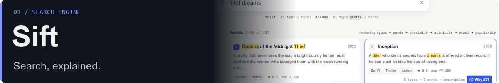
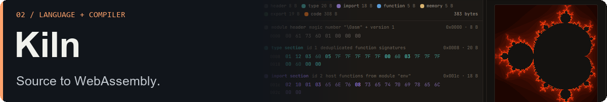
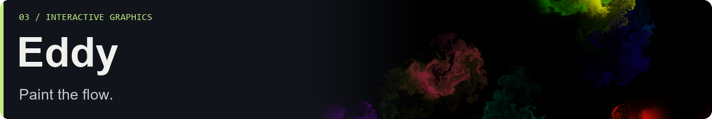

I build search engines, compilers, and interactive graphics — with the interesting parts exposed.

[Project notes →](./projects/sift.md) · TypeScript · Web Workers · Private source

[Project notes →](./projects/kiln.md) · Compiler design · WebAssembly · Private source

[Project notes →](./projects/eddy.md) · WebGL2 · GLSL · Private source

---

Open-source contributions

Focused changes to forks of [arshnah's projects](https://github.com/arshnah): [IPv6 discovery](https://github.com/goonerlogy-cyber/portgraph/pull/1), [terminal replay](https://github.com/goonerlogy-cyber/replay/pull/1), [JSON reports](https://github.com/goonerlogy-cyber/gitpulse/pull/1), [job completion](https://github.com/goonerlogy-cyber/toil/pull/1), [one-time sharing](https://github.com/goonerlogy-cyber/cipherdrop/pull/1), and [exact secret input](https://github.com/goonerlogy-cyber/zkaudit/pull/1).

These changes are merged in my forks. The linked PRs document the work and its verification.

[Repositories](https://github.com/goonerlogy-cyber?tab=repositories) · [Pull requests](https://github.com/pulls?q=is%3Apr+author%3Agoonerlogy-cyber)
