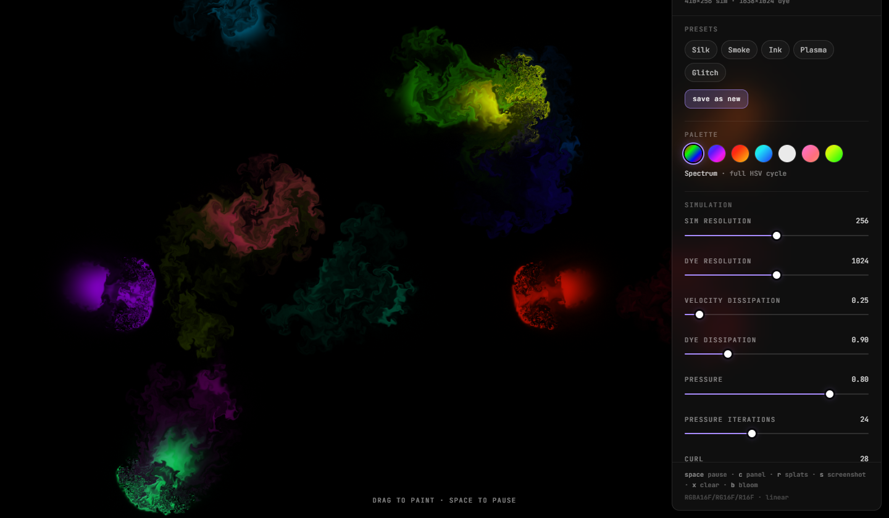

# Eddy

An interactive fluid-painting playground.

[Source and run instructions](https://github.com/justalivefornothing/eddy-fluid) · TypeScript · WebGL2 · GLSL

An interactive fluid playground with mouse-and-touch painting, tunable presets, and shareable looks. Raw WebGL2 passes turn velocity, pressure, and dye fields into something you can manipulate directly.

## What is inside

- Semi-Lagrangian advection, vorticity confinement, pressure solving, and gradient subtraction.
- Ping-pong framebuffers, separate simulation and dye resolutions, and negotiated texture formats.
- Presets, palette controls, local PNG capture, and settings encoded in shareable URL fragments.
- Optional audio-reactive input, with explicit microphone startup and cancellation.

## Giving audio a clean lifecycle

The [audio-lifecycle fix (#1)](https://github.com/justalivefornothing/eddy-fluid/pull/1), merged September 24, 2026, cancels pending microphone startup when audio is turned off. A stream granted after cancellation is disposed immediately; initialization failures and pending audio-context resumes also release their resources.

## Limits

Audio tests use mocked devices. This visual simulation has a lower-precision packed fallback; GPU performance varies by device and settings.

[Back to experiments](experiments.md) · [Back to profile](../README.md)
