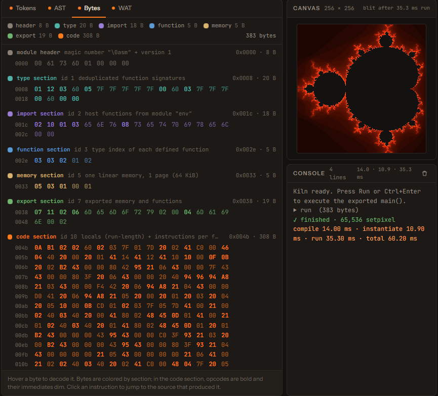

# Kiln

A small language, down to the bytes.

**TypeScript · Compiler design · WebAssembly · [Source code ?](https://github.com/justalivefornothing/kiln-lang)**

Kiln compiles a small statically typed language into real WebAssembly binaries in the browser. Its editor makes the compiler stages inspectable, from tokens and syntax trees to the emitted bytes and program output.

## The pipeline

Source → lexer → parser → type checker → binary emitter → WebAssembly → worker runtime.

The interface connects source, compiler inspectors, a console, and a canvas host. The Mandelbrot example demonstrates a program writing 65,536 pixels through that host.

## Execution stays isolated

Programs run in a dedicated worker with cancellation and an eight-second deadline. If worker creation is blocked, compilation and inspection still work, but execution reports an actionable error. There is no unbounded fallback on the UI thread.

Verification

The runtime change passed **53 tests**, the TypeScript/Vite build, and Linux/Windows Node 24 CI. Lint passed with four existing warnings. Browser verification covered Mandelbrot output and the unavailable-worker error path. The image above is an application screenshot.

[← Back to selected work](../README.md)
